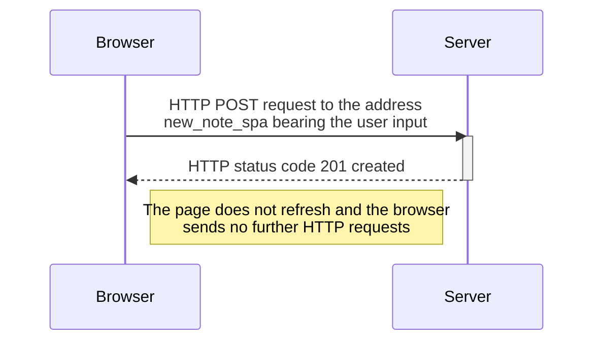

## New note in Single page app diagram

* The POST request to the address `new_note_spa` contains the new note containing both the content of the note and the date
* The Server responds with status code `201 created`. The browser stays on the same page, and it sends no further HTTP requests.
