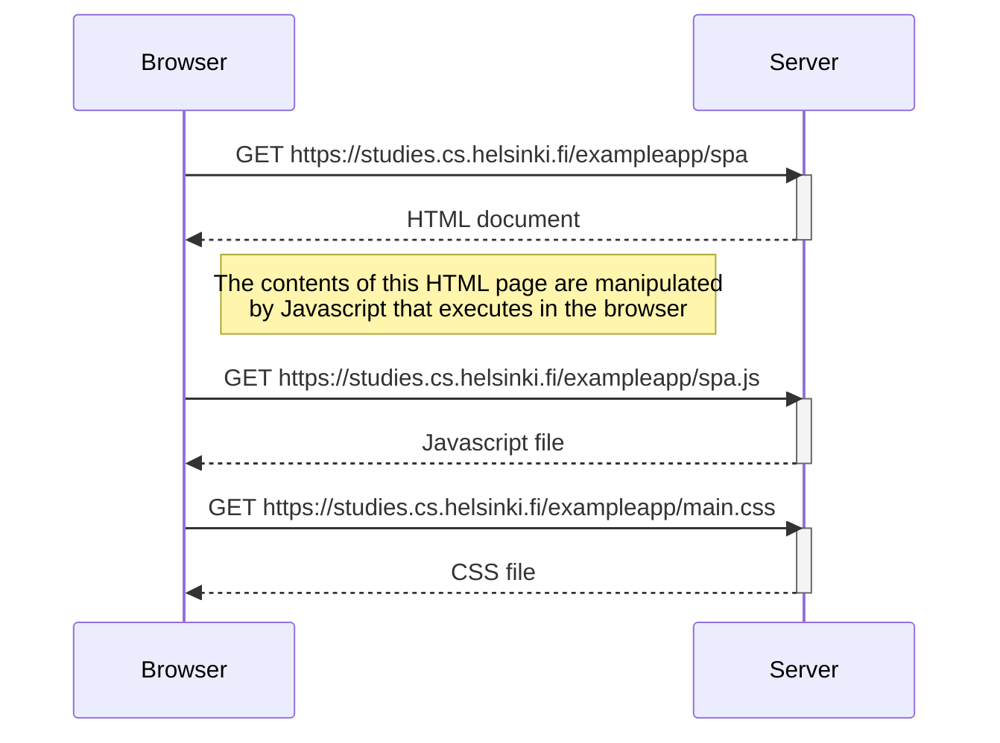

## Single Page App Diagram

```mermaid
sequenceDiagram
participant Browser
participant Server
Browser->>Server: GET https://studies.cs.helsinki.fi/exampleapp/spa
activate Server
Server-->>Browser: HTML document
deactivate Server
Note right of Browser: The contents of this HTML page are manipulated<br>by Javascript that executes in the browser
Browser->>Server: GET https://studies.cs.helsinki.fi/exampleapp/spa.js
activate Server
Server-->>Browser: Javascript file
deactivate Server
Browser->>Server: GET https://studies.cs.helsinki.fi/exampleapp/main.css
activate Server
Server-->>Browser: CSS file
deactivate Server
```
 

* The Single page app is made up of only one HTML page which is fetched from the server and manipulated with Javascript that executes in the browser